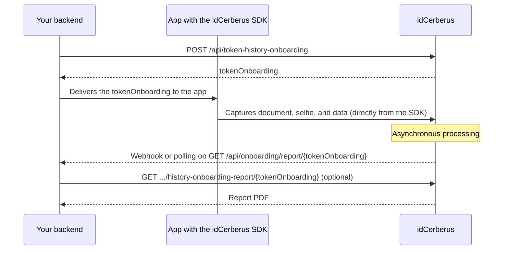

# Onboarding via SDK

Use this flow when the user's data capture happens through the idCerberus
SDK. Your company's back end generates a `tokenOnboarding`, hands that token
to the app integrated with the SDK, and then queries the result processed by
the backoffice.

The `tokenOnboarding` identifies the registration through the entire cycle:
creation, execution in the SDK, processing, result query, and PDF report
download.

<Warning>
  Don't confuse the two tokens in this flow. `access_token` authenticates
  your application and expires within minutes (see
  [Authentication](/en/guides/autenticacao)). `tokenOnboarding` identifies a
  specific registration and stays valid throughout the whole process, even
  after the `access_token` expires. If the `access_token` expires mid-flow,
  generate a new one. The `tokenOnboarding` doesn't change.
</Warning>

## What it is, why it exists, what it's for

1. **What it is:** a component (mobile or web) provided by idCerberus that
  captures the user's document, selfie, and data directly on their screen,
  following the onboarding script configured for your product.
2. **Why it exists:** capturing a document and biometrics with enough
  quality for validation (focus, lighting, angle, liveness) is a problem
  already solved by the SDK. Reimplementing this from scratch is expensive
  and error-prone.
3. **What it's for:** your application doesn't process images or implement a
  camera; it just generates the `tokenOnboarding`, hands it to the SDK, and
  then reads the result already ready. If your use case is just querying
  data (without capturing the user's document), you probably don't need the
  SDK. See [Choose the right service](/en/guides/escolha-o-servico-certo).

## When to use it

Use this integration when you need to:

1. start an onboarding flow in a mobile app or web experience integrated with the SDK;
2. send documents or initial data to support the registration;
3. query status, captured fields, and services run;
4. download the final PDF report for audit or storage purposes.

## Integration flow

1. Generate an API token at [Authentication](/en/guides/autenticacao).
2. Generate a `tokenOnboarding` for the user.
3. Send the `tokenOnboarding` to the app integrated with the SDK.
4. The user completes registration in the onboarding flow.
5. Query the result using the same `tokenOnboarding`.
6. If needed, download the onboarding report's PDF.



## Flow endpoints

| Step | Endpoint | Goal |
| --- | --- | --- |
| Generate API token | `POST /api/token-generate` | Authenticate the application |
| Generate TokenOnboarding | `POST /api/token-history-onboarding` | Create the registration identifier |
| Query result | `GET /api/onboarding/report/{tokenOnboarding}` | Get status, fields, and services processed |
| Download report | `GET /api/history-onboarding-report/{tokenOnboarding}` | Get the final onboarding PDF |

## Environments

| Environment | Base URL |
| --- | --- |
| Staging | `https://backoffice-hml.idcerberus.com` |
| Production | `https://backoffice.idcerberus.com` |

In the examples below, `{base_url}` represents the base URL of the chosen
environment.

## Generate a TokenOnboarding

Generates a new `tokenOnboarding` to identify the user's registration in the
SDK flow. This token will later be used to query the result processed by the
backoffice.

```http
POST /api/token-history-onboarding
```

Full endpoint:

```txt
{base_url}/api/token-history-onboarding
```

Authorization:

```http
Authorization: Bearer {jwt_token}
Content-Type: application/json
```

Example request:

```json
{
  "document": "cpf",
  "cpf": "cpf",
  "cnpj": "cnpj",
  "name": "name",
  "documentFiles": [
    {
      "documentFileType": "OTHER",
      "document": "data:image/jpeg;base64",
      "documentUrl": "url"
    }
  ]
}
```

Values like `"cpf": "cpf"` are placeholders to swap for the real data; see the
convention in [Quickstart](/en/guides/quickstart).

Main fields:

| Field | Description |
| --- | --- |
| `document` | CPF or CNPJ used in the onboarding |
| `cpf` | User's CPF, when applicable |
| `cnpj` | Related CNPJ, when applicable |
| `name` | Name of the user going through KYC |
| `documentFiles` | List of documents sent for the registration |
| `documentFiles.documentFileType` | Type of document sent |
| `documentFiles.document` | File in base64 |
| `documentFiles.documentUrl` | URL of the file to be sent |

Document types accepted in `documentFiles.documentFileType`:

| Value | Description |
| --- | --- |
| `RG_FRONT` | National ID (RG) front |
| `RG_BACK` | National ID (RG) back |
| `CNH` | Driver's license |
| `SELFIE` | Selfie |
| `SELFIE_3D` | 3D selfie |
| `OAB_FRONT` | Bar association card (OAB) front |
| `OAB_BACK` | Bar association card (OAB) back |
| `OTHER` | Other |
| `OTHER_SINGLE_FILE` | Other, single file |

Example response:

```json
{
  "tokenOnboarding": "56950dae-2d19-4092-a918-a612b3ca8f68",
  "dateHourProcess": "2023-02-17T16:49:41.577364Z"
}
```

| Field | Description |
| --- | --- |
| `tokenOnboarding` | UUID of the onboarding, used in subsequent queries |
| `dateHourProcess` | Date and time the token was created |

Example with `curl`:

```bash
curl --location '{base_url}/api/token-history-onboarding' \
  --header 'Content-Type: application/json' \
  --header 'Authorization: Bearer {jwt_token}' \
  --data '{
    "document": "cpf",
    "cpf": "cpf",
    "cnpj": "cnpj",
    "name": "name",
    "documentFiles": [
      {
        "documentFileType": "OTHER",
        "document": "data:image/jpeg;base64",
        "documentUrl": "url"
      }
    ]
  }'
```

## Query the result

Returns the status and results of an onboarding. To query, provide the
`tokenOnboarding` that was handed to the SDK.

```http
GET /api/onboarding/report/{tokenOnboarding}
```

Full endpoint:

```txt
{base_url}/api/onboarding/report/{tokenOnboarding}
```

Authorization:

```http
Authorization: Bearer {jwt_token}
```

Input field:

| Field | Description |
| --- | --- |
| `tokenOnboarding` | UUID of the onboarding returned to the SDK |

Main response fields:

| Field | Description |
| --- | --- |
| `tokenOnboarding` | UUID of the onboarding used for the query |
| `createdDate` | Date and time the onboarding was created |
| `numberSteps` | Number of steps configured for the registration |
| `status` | Onboarding status: `APPROVED`, `IN_PROCESS`, or `REFUSED` |
| `result` | Processing result: `AUT_APPROVED`, `IN_PROCESS`, or `REFUSED` |
| `fields` | Fields captured during registration |
| `services` | Services run during onboarding |

Example with `curl`:

```bash
curl --location '{base_url}/api/onboarding/report/<tokenOnboarding>' \
  --header 'Authorization: Bearer {jwt_token}'
```

Summarized example response:

```json
{
  "tokenOnboarding": "bb6adc72-0132-4b27-a723-98fe9f20cb81",
  "createdDate": "2022-06-15T19:02:04.877688Z",
  "numberSteps": 4,
  "status": "APPROVED",
  "result": "AUT_APPROVED",
  "fields": [
    {
      "field": "selfie_liveness_3d",
      "name": "Selfie Liveness 3D",
      "step": "1",
      "value": "https://bucket-onboarding.s3.amazonaws.com/arquivo"
    },
    {
      "field": "button_cnh",
      "name": "CNH - Carteira Nacional de Habilitação",
      "step": "2"
    }
  ],
  "services": [
    {
      "serviceName": "service_liveness_ft",
      "createdDate": "2022-06-15T19:02:06.233020Z",
      "status": "APPROVED",
      "statusMessage": "USER PASSED THE LIVENESS CHALLENGE",
      "fields": [],
      "rules": []
    }
  ]
}
```

### Captured fields

The `fields` array returns the data captured during registration.

| Field | Description |
| --- | --- |
| `fields.field` | Field alias |
| `fields.name` | Field name |
| `fields.step` | Step where the field was captured |
| `fields.value` | Captured value |

Example:

```json
{
  "field": "cnh_image",
  "name": "CNH",
  "step": "3.1",
  "value": "https://bucket-onboarding.s3.amazonaws.com/arquivo"
}
```

### Services run

The `services` array returns the services processed during onboarding, such
as OCR, Federal Revenue validation, PEP, FaceMatch, and Liveness.

| Field | Description |
| --- | --- |
| `services.serviceName` | Alias of the service run |
| `services.createdDate` | Date and time the service ran |
| `services.status` | Service status: `APPROVED`, `IN_PROCESS`, or `REFUSED` |
| `services.statusMessage` | Processing result or message |
| `services.fields` | Fields extracted by the service |
| `services.rules` | Rules evaluated during processing |

Example:

```json
{
  "serviceName": "SERVICE_FACE_MATCH",
  "createdDate": "2022-06-15T19:04:10.963326Z",
  "status": "APPROVED",
  "statusMessage": "SIMILARITY SCORE: 99.97%",
  "fields": [],
  "rules": []
}
```

### Processing rules

Some services return rules evaluated during processing. They help explain
why the onboarding was approved, refused, or is still processing.

Example:

```json
{
  "name": "situation_cpf_rfb",
  "value": "REGULAR"
}
```

## Download the PDF report

Downloads the onboarding report in PDF.

```http
GET /api/history-onboarding-report/{tokenOnboarding}
```

Full endpoint:

```txt
{base_url}/api/history-onboarding-report/{tokenOnboarding}
```

Authorization:

```http
Authorization: Bearer {jwt_token}
```

Input field:

| Field | Description |
| --- | --- |
| `tokenOnboarding` | UUID of the onboarding returned to the SDK |

Example with `curl`:

```bash
curl --location '{base_url}/api/history-onboarding-report/{tokenOnboarding}' \
  --header 'Authorization: Bearer {jwt_token}'
```

This endpoint doesn't return a JSON body. Use it when you need to store or
present the final onboarding report as a PDF.

## Tracking processing

There are two ways to know when an onboarding finishes processing: webhook
(idCerberus notifies your application) or polling (your application asks).
See [Webhooks](/en/guides/webhooks) to set up automatic notification. It's
the recommended approach, because it reduces unnecessary calls. Even with a
webhook configured, keep the polling below as a fallback: a failed webhook
delivery isn't resent automatically (details in
[Webhooks](/en/guides/webhooks)).

Query `GET /api/onboarding/report/{tokenOnboarding}` until the `status`
leaves `IN_PROCESS`.

1. Wait a few seconds between one query and the next. Don't poll every few
  milliseconds: the services behind onboarding may depend on external
  sources and take longer than a single-shot call.
2. Set a retry limit or maximum wait time in your application, with a clear
  path for "not done yet, notify the user, and try again later" instead of
  freezing the screen while waiting.
3. `REFUSED` is a final business result, not a technical error. The call
  itself succeeded (HTTP 200); it's the registration that wasn't approved.
  Don't treat `REFUSED` as a failure to retry. Treat it as a business
  decision your application needs to reflect to the user.

## Best practices

1. Generate the `tokenOnboarding` in the back end, never directly in the app.
2. Hand the SDK only the token needed to start the flow.
3. Use the same `tokenOnboarding` to query the result and download the report.
4. Treat `IN_PROCESS` as an intermediate state and query again later.
5. Store the PDF report only when there's an operational, regulatory, or audit need.

For technical endpoint details, see the
[API Reference](/en/api-reference/autorização/gerar-token-de-api).

## Next step

<CardGroup cols={2}>
  <Card icon="bolt" title="Webhooks" href="/en/guides/webhooks">
    Get notified automatically when the status changes, instead of only polling.
  </Card>
  <Card icon="display" title="Backoffice" href="/en/guides/backoffice">
    See a specific onboarding's result directly on screen, without code.
  </Card>
  <Card icon="triangle-exclamation" title="Status and errors" href="/en/guides/status-e-erros">
    Understand `APPROVED`, `IN_PROCESS`, `REFUSED`, and how to handle each one.
  </Card>
  <Card icon="key" title="Authentication" href="/en/guides/autenticacao">
    Review how to generate and renew the `access_token` used in this flow.
  </Card>
</CardGroup>
