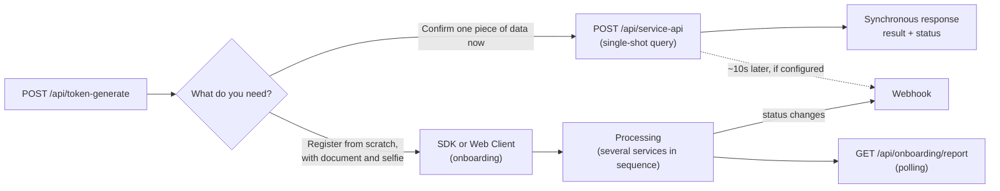

# Overview

The idCerberus API brings together digital onboarding, KYC, data enrichment,
biometrics, fraud prevention, risk analysis, and compliance services. The
integration was designed to support both complete onboarding flows and
single-shot queries by CPF or CNPJ.

## How it all fits together

Before diving into endpoints, tokens, and payloads, it's worth understanding
three pieces that repeat throughout this documentation. For each one: what it
is, why it exists, and what it's for in your implementation.

### Service

1. **What it is:** a specific query or check, like "CPF status at the
  Brazilian Federal Revenue" or "compare a selfie with a document." It has its
  own code (`SERVICE_SOMETHING`) and returns an isolated result.
2. **Why there are more than 300:** each type of data or check becomes a
  different service, because each company uses a different combination of
  them. You never need all of them.
3. **What it's for:** it's the unit you actually call. Every implementation
  starts by deciding which services solve your problem. See
  [Choose the right service](/en/guides/escolha-o-servico-certo).

### Single-shot query vs. onboarding

1. **What it is:** two ways to use a service. Single-shot means calling a
  service on its own, right away, directly through `POST /api/service-api`.
  Onboarding means combining several services into a guided journey, with
  steps, captured fields, and a final status (`APPROVED`, `IN_PROCESS`,
  `REFUSED`).
2. **Why both exist:** not every need is a full registration. Sometimes you
  just need to confirm one piece of data (single-shot); sometimes you need to
  guide the user through an entire KYC flow (onboarding).
3. **What it's for:** it defines the integration model you'll build. If the
  answer is "just confirm one piece of data right now," that's a single-shot
  query via API. If it's "register the user from scratch, with a document and
  a selfie," that's onboarding via SDK or Web Client.



The webhook is the same mechanism for both paths. See
[Webhooks](/en/guides/webhooks) to set it up.

### Product

1. **What it is:** your company's specific configuration, including which
  services are enabled, in what order they run in onboarding, and which are
  available for single-shot queries.
2. **Why it exists:** each idCerberus client uses a different set of services.
  The product is what ties "idCerberus API" to "what your company actually
  contracted."
3. **What it's for:** you never choose among all 300+ services; you choose
  from what's already enabled for your product. If a service you need doesn't
  respond or doesn't appear, the first suspect is that it's not enabled for
  your product, not an implementation error.

With that in mind, the question that defines where to start isn't "how do I
use the API," but rather: **will my application call isolated queries (API),
or will it guide the user through a complete registration (SDK/Web)?** The
answer defines the integration model below.

### Common questions at this stage

<AccordionGroup>
  <Accordion title="Do I need to implement both API and SDK?">
    No. Use the API when your application only needs single-shot queries. Use
    the SDK or Web Client when you need to guide the user through a complete
    registration. Many clients use only one of the two; others combine both:
    onboarding for the initial registration and single-shot API for
    re-queries later.
  </Accordion>
  <Accordion title="A service I need doesn't appear or always fails. What now?">
    First confirm whether it's enabled for your product. That's arranged in
    advance with React IT, it's not something you enable yourself. If it's
    enabled and still fails, follow
    [Troubleshooting](/en/guides/troubleshooting).
  </Accordion>
  <Accordion title="Can I switch integration models later?">
    Yes. API, SDK, and Web Client consume the same services underneath; the
    difference is only how your application triggers and consumes the
    result. Migrating from one model to another doesn't change the data
    returned.
  </Accordion>
  <Accordion title="Do I need to understand all 300+ services before starting?">
    No. Start with [Quickstart](/en/guides/quickstart) using a single test
    service, validate the end-to-end flow, and only then come back to the
    catalog to add the services that make sense for your case.
  </Accordion>
  <Accordion title='Why is the API URL called "backoffice"?'>
    `backoffice-hml.idcerberus.com` and `backoffice.idcerberus.com` are the
    same URLs used by the idCerberus admin panel, but when you call
    `/api/...` on them, you're talking to the API, not the visual interface.
    There's no separate URL for the API: it's the same domain, different
    endpoints.
  </Accordion>
</AccordionGroup>

## Integration models

| Model | When to use | Your application's responsibility |
| --- | --- | --- |
| API | When your company's back end will consume queries directly | Authenticating, building payloads, calling endpoints, and handling responses |
| SDK | When data and document capture happens in a mobile app | Generating `tokenOnboarding`, handing it to the SDK, and querying the result |
| Web Client | When the flow will run via WebView, a responsive site, or a QR Code | Directing the user to the flow and consuming the processed result |

Beyond these three, there are two complements that aren't integration models
on their own, but add on to any of them:

1. [Backoffice](/en/guides/backoffice): idCerberus's visual interface, for
  looking at results and testing queries without writing code.
2. [Webhooks](/en/guides/webhooks): notifies your application when the
  status changes, for both onboarding and single-shot queries, instead of it
  having to keep asking (polling).

## If you're just getting started

An API is a way for one system to talk to another. In practice, you send a
request to a URL and get back a response with the result.

You can test the examples in this documentation in three ways:

| Tool | Who it's for |
| --- | --- |
| Postman | Anyone who prefers filling in URL, headers, and body in a visual interface |
| PowerShell or CMD | Anyone on Windows who wants to test from the terminal |
| macOS or Linux terminal | Anyone using macOS, Linux, or a Unix development environment |

The basic flow is always the same:

1. Generate a token with `client` and `secret`.
2. Copy the returned `access_token`.
3. Send that token in the `Authorization` header.
4. Run the endpoint or service you want.
5. Read the `result` object and the technical status in `status`.

If you've never made an HTTP call before, start with
[Quickstart](/en/guides/quickstart).

## Environments

The API has separate environments for staging and production. The endpoints
are the same in both environments; to switch environments, just change the
base URL.

The HTTP method, headers, and payload stay the same. The environment is
chosen by the URL used in the call.

| Environment | Base URL |
| --- | --- |
| Staging | `https://backoffice-hml.idcerberus.com` |
| Production | `https://backoffice.idcerberus.com` |

In the documentation's examples, `{base_url}` represents the URL of the
chosen environment.

| Variable | Value |
| --- | --- |
| `base_url` | Base URL for staging or production |
| `generate token` | `api/token-generate` |
| `service-external-url` | `api/service-api` |
| `report-url` | `api/onboarding/report` |
| `token-url` | `api/token-history-onboarding` |

## Main endpoints

| Operation | Endpoint |
| --- | --- |
| Generate API token | `POST /api/token-generate` |
| Query onboarding result | `GET /api/onboarding/report/{tokenOnboarding}` |
| Download PDF result | `GET /api/history-onboarding-report/{tokenOnboarding}` |
| Generate `tokenOnboarding` | `POST /api/token-history-onboarding` |
| Run external service | `POST /api/service-api` |
| Query customer | `GET /api/customer?documentKey={cpf-or-cnpj}` |
| Change customer status | `POST /api/changeStatusOfCustomer` |

## Minimum flow to test

1. Generate a token at `POST /api/token-generate`.
2. Send the token in the `Authorization` header.
3. Choose a service under Individuals or Businesses.
4. Call `POST /api/service-api` with the `service` field.
5. Read `status.code`, `status.message`, and the data inside `result`.

## Pattern for external services

Individual (PF) and business (PJ) services are consumed through the same
technical endpoint:

```http
POST /api/service-api
```

The processing that runs is defined by the `service` field in the request
body. For example:

```json
{
  "service": "SERVICE_PERSON_DATA_ENRICHMENT",
  "cpf": "cpf"
}
```

## Response pattern

Most queries return:

```json
{
  "result": {},
  "status": {
    "code": 200,
    "message": "Success"
  }
}
```

| Field | Description |
| --- | --- |
| `result` | Business data returned by the query |
| `status.code` | Technical processing code |
| `status.message` | Technical processing message |
| `externalId` | External query identifier, when returned |

## Next steps

1. For authentication, see [Authentication](/en/guides/autenticacao).
2. For onboarding via SDK, see [Onboarding via SDK](/en/guides/onboarding-sdk).
3. For the CPF catalog, see [Individual Services](/guides/servicos-pessoa-fisica).
4. For the CNPJ catalog, see [Business Services](/guides/servicos-pessoa-juridica).
5. For endpoint-by-endpoint implementation, use the [API Reference](/api-reference/autorização/gerar-token-de-api).
