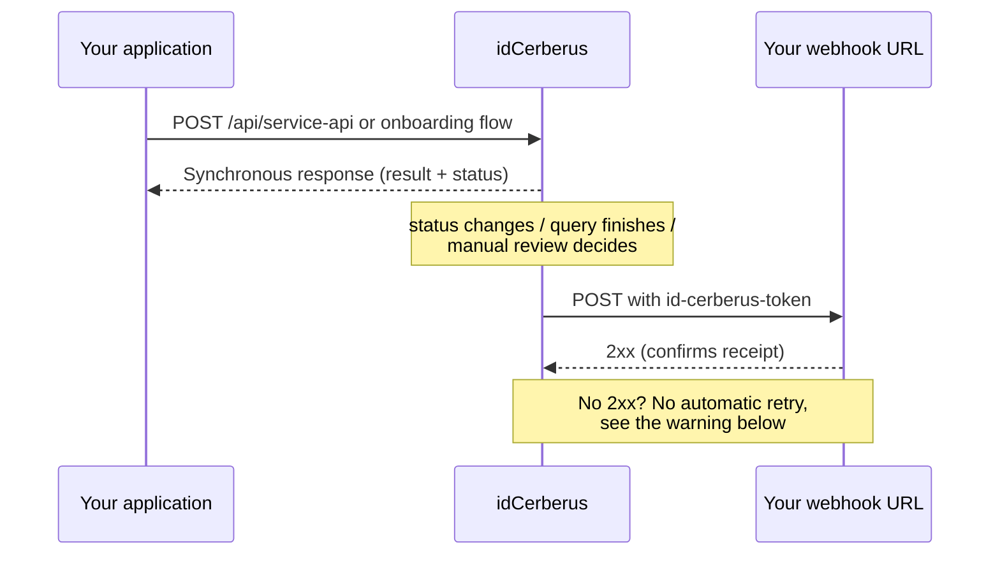

# Webhooks

Use webhooks to have idCerberus notify your application when an onboarding
changes status, or when a single-shot query finishes processing, instead of
your application having to keep asking (polling).

## What it is, why it exists, what it's for

1. **What it is:** a URL of your application that idCerberus calls
  automatically (`POST`) every time an onboarding's processing changes
  status.
2. **Why it exists:** querying `GET /api/onboarding/report/{tokenOnboarding}`
  in a loop until the status leaves `IN_PROCESS` works, but it burns calls
  and delays your application's reaction. The webhook flips this: you're
  notified the moment there's news.
3. **What it's for:** it's the recommended way to track onboarding in
  production. Reserve polling (see [Onboarding via SDK](/en/guides/onboarding-sdk))
  for when the webhook isn't configured yet, or as an occasional check.

<Info>
  Configuring the webhook (URL and security key) is currently done by the
  React IT team, it's not self-service via the API. Request activation at
  [contact@react-it.com](mailto:contact@react-it.com), providing the URL
  that should receive the calls.
</Info>

## How it works

1. Something relevant happens: an onboarding changes status (goes from
   `IN_PROCESS` to `APPROVED` or `REFUSED`), a manual review decision is
   made, or a single-shot query in `POST /api/service-api` finishes
   processing.
2. idCerberus builds the content (the same format as
   `GET /api/onboarding/report/{tokenOnboarding}`, adapted when the source
   is a single-shot query).
3. idCerberus makes a `POST` with that content to the URL configured for
   your product.
4. Your application responds with success (`2xx`) to confirm receipt.



<Info>
  The webhook isn't instantaneous in a strict sense. Automatic onboarding
  processing is checked every few seconds and fires when it finds a change;
  a single-shot query fires the webhook about 10 seconds after the HTTP
  response. A manual review decision (someone approves/rejects through the
  backoffice) fires right away. None of these times are a contractual SLA.
  Treat them as observed behavior, not a guarantee.
</Info>

<Warning>
  If your application doesn't respond with success, the call is marked
  internally as pending retry, but **there is no automatic process that
  keeps resending deliveries that failed**. A new delivery only happens if:
  (a) the same onboarding's content changes again later (this fires as a new
  delivery, not a retry), or (b) someone with access to the
  [Backoffice](/en/guides/backoffice) manually forces a resend on the
  screen. Because of this, don't treat webhooks as a delivery guarantee.
  Keep polling
  (`GET /api/onboarding/report/{tokenOnboarding}`) as a real safety net, not
  just a formality.
</Warning>

## Payload

The body format depends on the event's source.

**Onboarding (SDK or Web Client):** same format as the onboarding report.

```json
{
  "tokenOnboarding": "bb6adc72-0132-4b27-a723-98fe9f20cb81",
  "createdDate": "2022-06-15T19:02:04.877688Z",
  "numberSteps": 4,
  "status": "APPROVED",
  "result": "AUT_APPROVED",
  "fields": [],
  "services": []
}
```

See the full field table in
[Onboarding via SDK](/en/guides/onboarding-sdk#consultar-resultado): it's the
same structure.

**Single-shot query (`POST /api/service-api`):** the same JSON that already
came back in the call's synchronous HTTP response (`result`, `status`,
`onboardingStatus`, and `externalId`), not the onboarding report format
above.

## Authenticating the incoming call

Every webhook call arrives with a verification header:

```http
id-cerberus-token: {webhookKey}
```

Before processing the payload, check that `id-cerberus-token` matches the
key React IT gave you when setting up the webhook. This confirms the call
really came from idCerberus, not from a third party who found your URL.

<Warning>
  Don't expose the `webhookKey` in the front end or in public repositories. Treat it like any other authentication secret.
</Warning>

## Best practices

1. Respond quickly (ideally under a few seconds) and process the content
  afterward, asynchronously. A slow endpoint can be interpreted as a
  failure.
2. Always validate the `id-cerberus-token` header before trusting the
  payload.
3. Handle repeated events. Reprocessing the same `tokenOnboarding` with the
  same status shouldn't cause a duplicate side effect.
4. Don't treat `REFUSED` as a technical error. It's a business result, just
  like single-shot consumption via polling. See
  [Status and errors](/guides/status-e-erros).
5. Keep a polling fallback. Since there's no automatic resend for failed
  deliveries (see "How it works" above), this fallback is what guarantees
  your application doesn't stay stuck waiting for an event that won't
  arrive on its own.

## Common questions

<AccordionGroup>
  <Accordion title="Do I need to choose between webhook and polling?">
    No. Use the webhook as the primary mechanism and polling
    (`GET /api/onboarding/report/{tokenOnboarding}`) as a check or fallback,
    especially right after setting up the webhook for the first time.
  </Accordion>
  <Accordion title="Do I also get a webhook for single-shot queries?">
    Yes, if your product has a webhook configured. Single-shot queries at
    `POST /api/service-api` already return the result directly in the HTTP
    response; the webhook arrives afterward (around 10 seconds later), with
    the same content. In practice it's redundant for simple single-shot
    consumption; it matters more when you want to centralize everything
    (single-shot and onboarding) in a single listener instead of handling
    the API's synchronous response in multiple places in your code.
  </Accordion>
  <Accordion title="Can I configure more than one webhook URL?">
    The setup is one URL per product. If you need to distribute events to
    multiple internal systems, receive them at your own URL and distribute
    from there.
  </Accordion>
  <Accordion title="How do I know if my webhook is configured?">
    Run a test onboarding in staging and confirm whether your URL received
    the call. If you're not sure whether the setup was applied, check with
    whoever granted the access.
  </Accordion>
</AccordionGroup>

## Next step

<CardGroup cols={2}>
  <Card icon="mobile-screen" title="Onboarding via SDK" href="/en/guides/onboarding-sdk">
    See the full flow that generates the events the webhook notifies you about.
  </Card>
  <Card icon="display" title="Backoffice" href="/en/guides/backoffice">
    See delivery attempt logs and force a manual resend from the screen.
  </Card>
  <Card icon="triangle-exclamation" title="Status and errors" href="/guides/status-e-erros">
    Understand how to interpret `REFUSED`, `ERROR`, and other statuses received.
  </Card>
  <Card icon="book-open" title="Glossary" href="/guides/glossario">
    Check terms like `id-cerberus-token` and `tokenOnboarding`.
  </Card>
</CardGroup>
