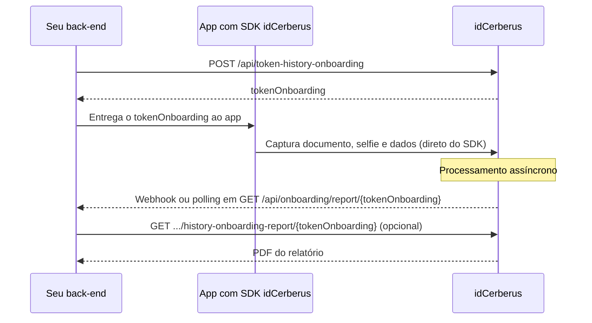

# Onboarding via SDK

Use este fluxo quando a captura dos dados do usuário acontecer pelo SDK
idCerberus. O back-end da sua empresa gera um `tokenOnboarding`, entrega esse
token ao aplicativo integrado ao SDK e depois consulta o resultado processado
pelo backoffice.

O `tokenOnboarding` identifica o cadastro durante todo o ciclo: criação,
execução no SDK, processamento, consulta de resultado e download do relatório em
PDF.

<Warning>
  Não confunda os dois tokens deste fluxo. `access_token` autentica a sua
  aplicação e expira em minutos (veja [Autenticação](/guides/autenticacao)).
  `tokenOnboarding` identifica um cadastro específico e continua válido durante
  todo o processo, mesmo depois do `access_token` expirar. Se o `access_token`
  expirar no meio do fluxo, gere um novo. O `tokenOnboarding` não muda.
</Warning>

## O que é, por que existe, pra que serve

1. **O que é:** um componente (mobile ou web) fornecido pela idCerberus que
  captura documento, selfie e dados do usuário diretamente na tela dele,
  seguindo o roteiro de onboarding configurado para o seu produto.
2. **Por que existe:** capturar documento e biometria com qualidade suficiente
  para validação (foco, iluminação, ângulo, prova de vida) é um problema já
  resolvido pelo SDK. Reimplementar isso do zero é caro e propenso a erro.
3. **Pra que serve pra você:** sua aplicação não processa imagem nem
  implementa câmera; só gera o `tokenOnboarding`, entrega ao SDK e depois lê
  o resultado já pronto. Se seu caso de uso é só consultar dados (sem capturar
  documento do usuário), você provavelmente não precisa do SDK. Veja
  [Escolha o serviço certo](/guides/escolha-o-servico-certo).

## Quando usar

Use esta integração quando precisar:

1. iniciar um fluxo de onboarding em aplicativo mobile ou experiência web
  integrada ao SDK;
2. enviar documentos ou dados iniciais para apoiar o cadastro;
3. consultar status, campos capturados e serviços executados;
4. baixar o relatório final em PDF para auditoria ou armazenamento.

## Fluxo de integração

1. Gere um token de API em [Autenticação](/guides/autenticacao).
2. Gere um `tokenOnboarding` para o usuário.
3. Envie o `tokenOnboarding` para o aplicativo integrado ao SDK.
4. O usuário realiza o cadastro no fluxo de onboarding.
5. Consulte o resultado usando o mesmo `tokenOnboarding`.
6. Se necessário, baixe o PDF do relatório do onboarding.



## Endpoints do fluxo

| Etapa | Endpoint | Objetivo |
| --- | --- | --- |
| Gerar token de API | `POST /api/token-generate` | Autenticar a aplicação |
| Gerar TokenOnboarding | `POST /api/token-history-onboarding` | Criar o identificador do cadastro |
| Consultar resultado | `GET /api/onboarding/report/{tokenOnboarding}` | Obter status, campos e serviços processados |
| Baixar relatório | `GET /api/history-onboarding-report/{tokenOnboarding}` | Obter o PDF final do onboarding |

## Ambientes

| Ambiente | Base URL |
| --- | --- |
| Homologação | `https://backoffice-hml.idcerberus.com` |
| Produção | `https://backoffice.idcerberus.com` |

Nos exemplos abaixo, `{base_url}` representa a URL base do ambiente escolhido.

## Gerar TokenOnboarding

Gera um novo `tokenOnboarding` para identificar o cadastro do usuário no fluxo
do SDK. Esse token será usado depois para consultar o resultado processado pelo
backoffice.

```http
POST /api/token-history-onboarding
```

Endpoint completo:

```txt
{base_url}/api/token-history-onboarding
```

Autorização:

```http
Authorization: Bearer {jwt_token}
Content-Type: application/json
```

Exemplo de requisição:

```json
{
  "document": "cpf",
  "cpf": "cpf",
  "cnpj": "cnpj",
  "name": "name",
  "documentFiles": [
    {
      "documentFileType": "OTHER",
      "document": "data:image/jpeg;base64",
      "documentUrl": "url"
    }
  ]
}
```

Valores como `"cpf": "cpf"` são placeholders a substituir pelo dado real; veja a
convenção em [Quickstart](/guides/quickstart).

Campos principais:

| Campo | Descrição |
| --- | --- |
| `document` | CPF ou CNPJ usado no onboarding |
| `cpf` | CPF do usuário, quando aplicável |
| `cnpj` | CNPJ relacionado, quando aplicável |
| `name` | Nome do usuário que fará o KYC |
| `documentFiles` | Lista de documentos enviados para o cadastro |
| `documentFiles.documentFileType` | Tipo do documento enviado |
| `documentFiles.document` | Arquivo em base64 |
| `documentFiles.documentUrl` | URL do arquivo a ser enviado |

Tipos de documento aceitos em `documentFiles.documentFileType`:

| Valor | Descrição |
| --- | --- |
| `RG_FRONT` | RG frente |
| `RG_BACK` | RG verso |
| `CNH` | Carteira Nacional de Habilitação |
| `SELFIE` | Selfie |
| `SELFIE_3D` | Selfie 3D |
| `OAB_FRONT` | Carteira OAB frente |
| `OAB_BACK` | Carteira OAB verso |
| `OTHER` | Outros |
| `OTHER_SINGLE_FILE` | Outros, arquivo único |

Exemplo de resposta:

```json
{
  "tokenOnboarding": "56950dae-2d19-4092-a918-a612b3ca8f68",
  "dateHourProcess": "2023-02-17T16:49:41.577364Z"
}
```

| Campo | Descrição |
| --- | --- |
| `tokenOnboarding` | UUID do onboarding usado nas próximas consultas |
| `dateHourProcess` | Data e hora de criação do token |

Exemplo com `curl`:

```bash
curl --location '{base_url}/api/token-history-onboarding' \
  --header 'Content-Type: application/json' \
  --header 'Authorization: Bearer {jwt_token}' \
  --data '{
    "document": "cpf",
    "cpf": "cpf",
    "cnpj": "cnpj",
    "name": "name",
    "documentFiles": [
      {
        "documentFileType": "OTHER",
        "document": "data:image/jpeg;base64",
        "documentUrl": "url"
      }
    ]
  }'
```

## Consultar resultado

Retorna o status e os resultados de um onboarding. Para consultar, informe o
`tokenOnboarding` que foi entregue ao SDK.

```http
GET /api/onboarding/report/{tokenOnboarding}
```

Endpoint completo:

```txt
{base_url}/api/onboarding/report/{tokenOnboarding}
```

Autorização:

```http
Authorization: Bearer {jwt_token}
```

Campo de entrada:

| Campo | Descrição |
| --- | --- |
| `tokenOnboarding` | UUID do onboarding retornado ao SDK |

Campos principais do retorno:

| Campo | Descrição |
| --- | --- |
| `tokenOnboarding` | UUID do onboarding usado para a consulta |
| `createdDate` | Data e hora de criação do onboarding |
| `numberSteps` | Número de etapas configuradas para o cadastro |
| `status` | Status do onboarding: `APPROVED`, `IN_PROCESS` ou `REFUSED` |
| `result` | Resultado do processamento: `AUT_APPROVED`, `IN_PROCESS` ou `REFUSED` |
| `fields` | Campos capturados durante o cadastro |
| `services` | Serviços executados durante o onboarding |

Exemplo com `curl`:

```bash
curl --location '{base_url}/api/onboarding/report/<tokenOnboarding>' \
  --header 'Authorization: Bearer {jwt_token}'
```

Exemplo de resposta resumido:

```json
{
  "tokenOnboarding": "bb6adc72-0132-4b27-a723-98fe9f20cb81",
  "createdDate": "2022-06-15T19:02:04.877688Z",
  "numberSteps": 4,
  "status": "APPROVED",
  "result": "AUT_APPROVED",
  "fields": [
    {
      "field": "selfie_liveness_3d",
      "name": "Selfie Liveness 3D",
      "step": "1",
      "value": "https://bucket-onboarding.s3.amazonaws.com/arquivo"
    },
    {
      "field": "button_cnh",
      "name": "CNH - Carteira Nacional de Habilitação",
      "step": "2"
    }
  ],
  "services": [
    {
      "serviceName": "service_liveness_ft",
      "createdDate": "2022-06-15T19:02:06.233020Z",
      "status": "APPROVED",
      "statusMessage": "USER PASSED THE LIVENESS CHALLENGE",
      "fields": [],
      "rules": []
    }
  ]
}
```

### Campos capturados

O array `fields` retorna os dados capturados durante o cadastro.

| Campo | Descrição |
| --- | --- |
| `fields.field` | Alias do campo |
| `fields.name` | Nome do campo |
| `fields.step` | Etapa em que o campo foi capturado |
| `fields.value` | Valor capturado |

Exemplo:

```json
{
  "field": "cnh_image",
  "name": "CNH",
  "step": "3.1",
  "value": "https://bucket-onboarding.s3.amazonaws.com/arquivo"
}
```

### Serviços executados

O array `services` retorna os serviços processados durante o onboarding, como
OCR, validação na Receita Federal, PEP, FaceMatch e Liveness.

| Campo | Descrição |
| --- | --- |
| `services.serviceName` | Alias do serviço executado |
| `services.createdDate` | Data e hora de execução do serviço |
| `services.status` | Status do serviço: `APPROVED`, `IN_PROCESS` ou `REFUSED` |
| `services.statusMessage` | Resultado ou mensagem do processamento |
| `services.fields` | Campos extraídos pelo serviço |
| `services.rules` | Regras avaliadas durante o processamento |

Exemplo:

```json
{
  "serviceName": "SERVICE_FACE_MATCH",
  "createdDate": "2022-06-15T19:04:10.963326Z",
  "status": "APPROVED",
  "statusMessage": "SIMILARITY SCORE: 99.97%",
  "fields": [],
  "rules": []
}
```

### Regras de processamento

Alguns serviços retornam regras avaliadas no processamento. Elas ajudam a
entender por que o onboarding foi aprovado, recusado ou ficou em processamento.

Exemplo:

```json
{
  "name": "situation_cpf_rfb",
  "value": "REGULAR"
}
```

## Baixar relatório em PDF

Realiza o download do relatório do onboarding em PDF.

```http
GET /api/history-onboarding-report/{tokenOnboarding}
```

Endpoint completo:

```txt
{base_url}/api/history-onboarding-report/{tokenOnboarding}
```

Autorização:

```http
Authorization: Bearer {jwt_token}
```

Campo de entrada:

| Campo | Descrição |
| --- | --- |
| `tokenOnboarding` | UUID do onboarding retornado ao SDK |

Exemplo com `curl`:

```bash
curl --location '{base_url}/api/history-onboarding-report/{tokenOnboarding}' \
  --header 'Authorization: Bearer {jwt_token}'
```

Esse endpoint não retorna um body JSON. Use-o quando precisar armazenar ou
apresentar o relatório final do processo de onboarding em PDF.

## Acompanhar o processamento

Existem duas formas de saber quando um onboarding termina de processar:
webhook (a idCerberus avisa a sua aplicação) ou polling (a sua aplicação
pergunta). Veja [Webhooks](/guides/webhooks) para configurar o aviso
automático. É a forma recomendada, porque reduz chamadas desnecessárias.
Mesmo com webhook configurado, mantenha o polling abaixo como fallback: uma
entrega de webhook que falha não é reenviada automaticamente (detalhes em
[Webhooks](/guides/webhooks)).

Consulte `GET /api/onboarding/report/{tokenOnboarding}` até o `status` sair de
`IN_PROCESS`.

1. Espere alguns segundos entre uma consulta e outra. Não faça polling a cada
  poucos milissegundos: os serviços por trás do onboarding podem depender de
  bases externas e levar mais tempo que uma chamada avulsa.
2. Defina um limite de tentativas ou um tempo máximo de espera na sua
  aplicação, com um caminho claro para "ainda não terminou, avise o usuário e
  tente de novo depois" em vez de travar a tela esperando.
3. `REFUSED` é um resultado final do negócio, não um erro técnico. A chamada em
  si teve sucesso (HTTP 200); o cadastro é que não foi aprovado. Não trate
  `REFUSED` como falha para retry. Trate como decisão de negócio que a sua
  aplicação precisa refletir para o usuário.

## Boas práticas

1. Gere o `tokenOnboarding` no back-end, nunca diretamente no aplicativo.
2. Entregue ao SDK apenas o token necessário para iniciar o fluxo.
3. Use o mesmo `tokenOnboarding` para consultar resultado e baixar relatório.
4. Trate `IN_PROCESS` como estado intermediário e consulte novamente depois.
5. Armazene o relatório PDF somente quando houver necessidade operacional,
  regulatória ou de auditoria.

Para detalhes técnicos dos endpoints, consulte a
[API Reference](/api-reference/autorização/gerar-token-de-api).

## Próximo passo

<CardGroup cols={2}>
  <Card icon="bolt" title="Webhooks" href="/guides/webhooks">
    Seja avisado automaticamente quando o status mudar, em vez de só consultar.
  </Card>
  <Card icon="display" title="Backoffice" href="/guides/backoffice">
    Veja o resultado de um onboarding específico direto na tela, sem código.
  </Card>
  <Card icon="triangle-exclamation" title="Status e erros" href="/guides/status-e-erros">
    Entenda `APPROVED`, `IN_PROCESS`, `REFUSED` e como tratar cada um.
  </Card>
  <Card icon="key" title="Autenticação" href="/guides/autenticacao">
    Revise como gerar e renovar o `access_token` usado neste fluxo.
  </Card>
</CardGroup>
