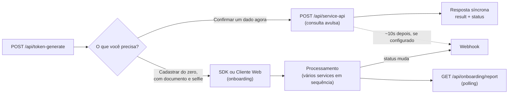

# Visão geral

A API idCerberus reúne serviços de onboarding digital, KYC, enriquecimento de
dados, biometria, prevenção à fraude, análise de risco e compliance. A integração
foi desenhada para permitir tanto fluxos completos de onboarding quanto consumo
avulso de consultas por CPF ou CNPJ.

## Como tudo se encaixa

Antes de entrar em endpoint, token e payload, vale entender três peças que se
repetem em toda a documentação. Para cada uma: o que é, por que existe e pra
que serve na sua implementação.

### Service

1. **O que é:** uma consulta ou verificação específica, como "situação do CPF na
  Receita Federal" ou "comparar selfie com documento". Tem um código próprio
  (`SERVICE_ALGUMA_COISA`) e devolve um resultado isolado.
2. **Por que existem mais de 300:** cada tipo de dado ou verificação vira um
  service diferente, porque cada empresa usa uma combinação diferente deles.
  Você nunca precisa de todos.
3. **Pra que serve pra você:** é a unidade que você efetivamente chama. Toda
  implementação começa por decidir quais services resolvem o seu problema —
  veja [Escolha o serviço certo](/guides/escolha-o-servico-certo).

### Consulta avulsa vs. onboarding

1. **O que é:** duas formas de usar um service. Avulsa é chamar um service
  sozinho, na hora, direto em `POST /api/service-api`. Onboarding é combinar
  vários services em uma jornada guiada, com etapas, campos capturados e um
  status final (`APPROVED`, `IN_PROCESS`, `REFUSED`).
2. **Por que as duas existem:** nem toda necessidade é um cadastro completo.
  Às vezes você só precisa confirmar um dado pontual (avulsa); às vezes precisa
  conduzir o usuário por um fluxo de KYC inteiro (onboarding).
3. **Pra que serve pra você:** define o modelo de integração que você vai
  construir. Se a resposta é "só confirmar um dado agora", é avulsa via API. Se
  é "cadastrar o usuário do zero, com documento e selfie", é onboarding via
  SDK ou Cliente Web.



O webhook é o mesmo mecanismo para os dois caminhos — veja
[Webhooks](/guides/webhooks) para configurar.

### Produto

1. **O que é:** a configuração específica da sua empresa — quais services estão
  liberados, em qual ordem entram no onboarding e quais ficam disponíveis para
  consulta avulsa.
2. **Por que existe:** cada cliente da idCerberus usa um conjunto diferente de
  services. O produto é o que amarra "API idCerberus" a "o que a sua empresa
  efetivamente contratou".
3. **Pra que serve pra você:** você nunca escolhe entre todos os 300+ services —
  escolhe dentro do que já foi habilitado para o seu produto. Se um service que
  você precisa não responde ou não aparece, o primeiro suspeito é ele não estar
  liberado no seu produto, não um erro de implementação.

Com isso em mente, a pergunta que define por onde começar não é "como uso a
API", e sim: **minha aplicação vai chamar consultas isoladas (API), ou vai guiar
o usuário por um cadastro completo (SDK/Web)?** A resposta define o modelo de
integração abaixo.

### Dúvidas comuns nessa fase

<AccordionGroup>
  <Accordion title="Preciso implementar API e SDK juntos?">
    Não. Use API quando sua aplicação só precisa de consultas pontuais. Use
    SDK ou Cliente Web quando precisa conduzir o usuário por um cadastro
    completo. Muitos clientes usam só um dos dois; outros combinam ambos —
    onboarding para o cadastro inicial e API avulsa para reconsultas depois.
  </Accordion>
  <Accordion title="Um service que eu preciso não aparece ou sempre falha. E agora?">
    Confirme primeiro se ele está liberado no seu produto — isso é combinado
    previamente com a React IT, não é algo que você habilita sozinho. Se
    estiver liberado e mesmo assim falhar, siga
    [Troubleshooting](/guides/troubleshooting).
  </Accordion>
  <Accordion title="Posso trocar de modelo de integração depois?">
    Sim. API, SDK e Cliente Web consomem os mesmos services por baixo; a
    diferença é só a forma como sua aplicação dispara e consome o resultado.
    Migrar de um modelo para outro não muda os dados retornados.
  </Accordion>
  <Accordion title="Preciso entender os 300+ services antes de começar?">
    Não. Comece pelo [Quickstart](/guides/quickstart) com um único service de
    teste, valide o fluxo de ponta a ponta e só depois volte ao catálogo para
    adicionar os services que fazem sentido pro seu caso.
  </Accordion>
  <Accordion title='Por que a URL da API se chama "backoffice"?'>
    `backoffice-hml.idcerberus.com` e `backoffice.idcerberus.com` são as
    mesmas URLs usadas pelo painel administrativo da idCerberus — mas quando
    você chama `/api/...` nelas, está falando com a API, não com a interface
    visual. Não existe URL separada para API: é o mesmo domínio, endpoints
    diferentes.
  </Accordion>
</AccordionGroup>

## Modelos de integração

| Modelo | Quando usar | Responsabilidade da sua aplicação |
| --- | --- | --- |
| API | Quando o back-end da sua empresa vai consumir consultas diretamente | Autenticar, montar payloads, chamar endpoints e tratar responses |
| SDK | Quando a captura de dados e documentos acontece em aplicativo mobile | Gerar `tokenOnboarding`, entregar ao SDK e consultar resultado |
| Cliente Web | Quando o fluxo será feito via WebView, site responsivo ou QR Code | Direcionar o usuário ao fluxo e consumir o resultado processado |

Além desses três, existem dois complementos que não são modelos de
integração por si só, mas se somam a qualquer um deles:

1. [Backoffice](/guides/backoffice): interface visual da idCerberus, para
  olhar resultados e testar consultas sem escrever código.
2. [Webhooks](/guides/webhooks): avisa sua aplicação quando o status mudar —
  vale tanto para onboarding quanto para consulta avulsa — em vez de ela
  ficar perguntando (polling).

## Se você está começando agora

Uma API é uma forma de um sistema conversar com outro. Na prática, você envia um
request para uma URL e recebe um response com o resultado.

Você pode testar os exemplos desta documentação de três formas:

| Ferramenta | Para quem é indicada |
| --- | --- |
| Postman | Quem prefere preencher URL, headers e body em uma interface visual |
| PowerShell ou CMD | Quem está usando Windows e quer testar pelo terminal |
| Terminal do macOS ou Linux | Quem usa macOS, Linux ou ambiente de desenvolvimento Unix |

O fluxo básico é sempre o mesmo:

1. Gerar token com `client` e `secret`.
2. Copiar o `access_token` retornado.
3. Enviar esse token no header `Authorization`.
4. Executar o endpoint ou serviço desejado.
5. Ler o objeto `result` e o status técnico em `status`.

Se você nunca executou uma chamada HTTP, comece pelo [Quickstart](/guides/quickstart).

## Ambientes

A API possui ambientes separados para homologação e produção. Os endpoints são os
mesmos nos dois ambientes; para trocar de ambiente, altere apenas a URL base.

Método HTTP, headers e payload permanecem iguais. A escolha do ambiente é feita
pela URL informada na chamada.

| Ambiente | Base URL |
| --- | --- |
| Homologação | `https://backoffice-hml.idcerberus.com` |
| Produção | `https://backoffice.idcerberus.com` |

Nos exemplos da documentação, `{base_url}` representa a URL do ambiente escolhido.

| Variável | Valor |
| --- | --- |
| `base_url` | URL base de homologação ou produção |
| `gerar token` | `api/token-generate` |
| `service-external-url` | `api/service-api` |
| `report-url` | `api/onboarding/report` |
| `token-url` | `api/token-history-onboarding` |

## Endpoints principais

| Operação | Endpoint |
| --- | --- |
| Gerar token de API | `POST /api/token-generate` |
| Consultar resultado de onboarding | `GET /api/onboarding/report/{tokenOnboarding}` |
| Baixar PDF do resultado | `GET /api/history-onboarding-report/{tokenOnboarding}` |
| Gerar `tokenOnboarding` | `POST /api/token-history-onboarding` |
| Executar serviço externo | `POST /api/service-api` |
| Consultar cliente | `GET /api/customer?documentKey={cpf-ou-cnpj}` |
| Alterar status de cliente | `POST /api/changeStatusOfCustomer` |

## Fluxo mínimo para testar

1. Gere um token em `POST /api/token-generate`.
2. Envie o token no header `Authorization`.
3. Escolha um serviço em Pessoa Física ou Pessoa Jurídica.
4. Chame `POST /api/service-api` com o campo `service`.
5. Leia `status.code`, `status.message` e os dados dentro de `result`.

## Padrão dos serviços externos

Os serviços de pessoa física e pessoa jurídica são consumidos pelo mesmo
endpoint técnico:

```http
POST /api/service-api
```

O processamento executado é definido pelo campo `service` no body da requisição.
Por exemplo:

```json
{
  "service": "SERVICE_PERSON_DATA_ENRICHMENT",
  "cpf": "cpf"
}
```

## Padrão de resposta

A maioria das consultas retorna:

```json
{
  "result": {},
  "status": {
    "code": 200,
    "message": "Success"
  }
}
```

| Campo | Descrição |
| --- | --- |
| `result` | Dados de negócio retornados pela consulta |
| `status.code` | Código técnico do processamento |
| `status.message` | Mensagem técnica do processamento |
| `externalId` | Identificador externo da consulta, quando retornado |

## Próximos passos

1. Para autenticação, veja [Autenticação](/guides/autenticacao).
2. Para onboarding via SDK, veja [Onboarding via SDK](/guides/onboarding-sdk).
3. Para catálogo de CPF, veja [Serviços de Pessoa Física](/guides/servicos-pessoa-fisica).
4. Para catálogo de CNPJ, veja [Serviços de Pessoa Jurídica](/guides/servicos-pessoa-juridica).
5. Para implementação endpoint a endpoint, use a [API Reference](/api-reference/autorização/gerar-token-de-api).
