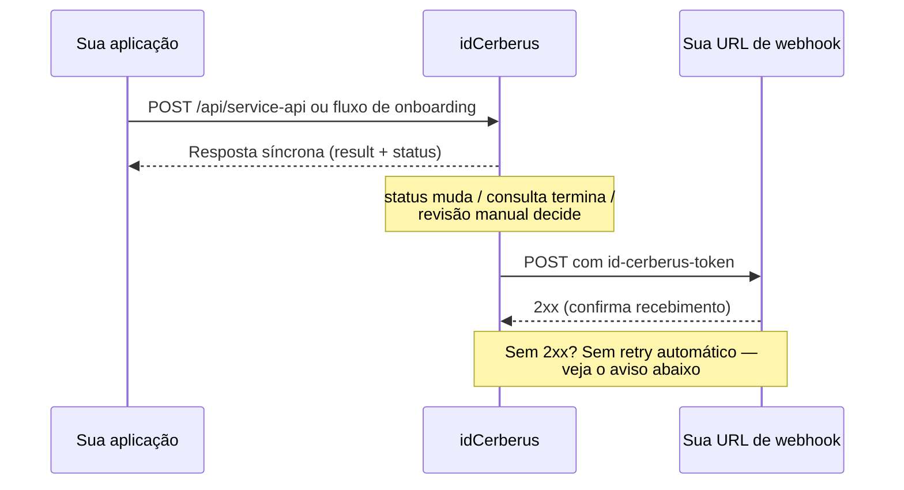

# Webhooks

Use webhooks para que a idCerberus avise a sua aplicação quando um onboarding
mudar de status — ou quando uma consulta avulsa terminar de processar — em
vez de sua aplicação precisar ficar perguntando (polling).

## O que é, por que existe, pra que serve

1. **O que é:** uma URL da sua aplicação que a idCerberus chama automaticamente
  (`POST`) toda vez que o processamento de um onboarding muda de status.
2. **Por que existe:** consultar `GET /api/onboarding/report/{tokenOnboarding}`
  em loop até o status sair de `IN_PROCESS` funciona, mas gasta chamadas e
  atrasa a reação da sua aplicação. O webhook inverte isso: você é avisado no
  momento em que há novidade.
3. **Pra que serve pra você:** é a forma recomendada de acompanhar onboarding
  em produção. Reserve o polling (veja [Onboarding via SDK](/guides/onboarding-sdk))
  para quando o webhook ainda não estiver configurado, ou como conferência
  ocasional.

<Info>
  Configurar o webhook (URL e chave de segurança) hoje é feito pelo time da
  React IT, não é self-service pela API. Peça a ativação em
  [contact@react-it.com](mailto:contact@react-it.com) informando a URL que
  deve receber as chamadas.
</Info>

## Como funciona

1. Algo relevante acontece: um onboarding muda de status (sai de `IN_PROCESS`
   para `APPROVED` ou `REFUSED`), uma decisão de revisão manual é tomada, ou
   uma consulta avulsa em `POST /api/service-api` termina de processar.
2. A idCerberus monta o conteúdo (o mesmo formato de
   `GET /api/onboarding/report/{tokenOnboarding}`, adaptado quando a origem é
   uma consulta avulsa).
3. A idCerberus faz `POST` desse conteúdo para a URL configurada no seu
   produto.
4. Sua aplicação responde com sucesso (`2xx`) para confirmar o recebimento.



<Info>
  O webhook não é instantâneo no sentido estrito. Processamento automático de
  onboarding é verificado a cada poucos segundos e disparado quando encontra
  uma mudança; consulta avulsa dispara o webhook cerca de 10 segundos depois
  da resposta HTTP. Decisão de revisão manual (alguém aprova/recusa pelo
  backoffice) dispara na hora. Nenhum desses tempos é um SLA contratual —
  trate como comportamento observado, não como garantia.
</Info>

<Warning>
  Se a sua aplicação não responder com sucesso, a chamada é marcada
  internamente como pendente de nova tentativa, mas **não existe um processo
  automático que fica reenviando entregas que falharam**. Um novo envio só
  acontece se: (a) o mesmo onboarding mudar de conteúdo de novo mais tarde
  (dispara como entrega nova, não como retry), ou (b) alguém com acesso ao
  [Backoffice](/guides/backoffice) forçar o reenvio manualmente na tela. Por
  isso, não trate webhook como garantia de entrega — mantenha o polling
  (`GET /api/onboarding/report/{tokenOnboarding}`) como rede de segurança
  real, não só como formalidade.
</Warning>

## Payload

O formato do corpo depende da origem do evento.

**Onboarding (SDK ou Cliente Web):** mesmo formato do relatório de onboarding.

```json
{
  "tokenOnboarding": "bb6adc72-0132-4b27-a723-98fe9f20cb81",
  "createdDate": "2022-06-15T19:02:04.877688Z",
  "numberSteps": 4,
  "status": "APPROVED",
  "result": "AUT_APPROVED",
  "fields": [],
  "services": []
}
```

Veja a tabela de campos completa em
[Onboarding via SDK](/guides/onboarding-sdk#consultar-resultado) — é a
mesma estrutura.

**Consulta avulsa (`POST /api/service-api`):** o mesmo JSON que já veio na
resposta HTTP síncrona da chamada — `result`, `status`, `onboardingStatus` e
`externalId`, não o formato de relatório de onboarding acima.

## Autenticar a chamada recebida

Toda chamada de webhook chega com um header de verificação:

```http
id-cerberus-token: {webhookKey}
```

Antes de processar o payload, confira se `id-cerberus-token` bate com a chave
que a React IT te passou ao configurar o webhook. Isso confirma que a chamada
veio mesmo da idCerberus, e não de terceiros que descobriram sua URL.

<Warning>
  Não exponha a `webhookKey` no front-end nem em repositórios públicos. Trate-a
  como qualquer outro segredo de autenticação.
</Warning>

## Boas práticas

1. Responda rápido (idealmente abaixo de alguns segundos) e processe o
  conteúdo depois, de forma assíncrona. Um endpoint lento pode ser
  interpretado como falha.
2. Sempre valide o header `id-cerberus-token` antes de confiar no payload.
3. Trate eventos repetidos. Reprocessar o mesmo `tokenOnboarding` com o mesmo
  status não deve causar efeito colateral duplicado.
4. Não trate `REFUSED` como erro técnico — é um resultado de negócio, igual ao
  consumo avulso via polling. Veja
  [Status e erros](/guides/status-e-erros).
5. Mantenha um fallback de polling. Como não existe reenvio automático para
  entregas que falharam (veja "Como funciona" acima), esse fallback é o que
  garante que sua aplicação não fique presa esperando um evento que não vai
  chegar sozinho.

## Dúvidas comuns

<AccordionGroup>
  <Accordion title="Preciso escolher entre webhook e polling?">
    Não. Use o webhook como principal e o polling
    (`GET /api/onboarding/report/{tokenOnboarding}`) como conferência ou
    fallback, especialmente logo após configurar o webhook pela primeira vez.
  </Accordion>
  <Accordion title="Recebo um webhook por consulta avulsa também?">
    Sim, se o seu produto tiver webhook configurado. Consultas avulsas em
    `POST /api/service-api` já retornam o resultado direto na resposta HTTP —
    o webhook chega depois (por volta de 10 segundos), com o mesmo conteúdo.
    Na prática ele é redundante para consumo avulso simples; ele importa mais
    quando você quer centralizar tudo (avulso e onboarding) num único
    listener em vez de tratar a resposta síncrona da API em vários lugares do
    seu código.
  </Accordion>
  <Accordion title="Posso configurar mais de uma URL de webhook?">
    A configuração é uma URL por produto. Se você precisa distribuir eventos
    para múltiplos sistemas internos, receba na sua própria URL e distribua a
    partir dali.
  </Accordion>
  <Accordion title="Como sei se meu webhook está configurado?">
    Faça um onboarding de teste em homologação e confirme se a sua URL recebeu
    a chamada. Se não tiver certeza se a configuração foi aplicada, confirme
    com quem liberou o acesso.
  </Accordion>
</AccordionGroup>

## Próximo passo

<CardGroup cols={2}>
  <Card icon="mobile-screen" title="Onboarding via SDK" href="/guides/onboarding-sdk">
    Veja o fluxo completo que gera os eventos que o webhook avisa.
  </Card>
  <Card icon="display" title="Backoffice" href="/guides/backoffice">
    Veja logs de tentativas e force um reenvio manual pela tela.
  </Card>
  <Card icon="triangle-exclamation" title="Status e erros" href="/guides/status-e-erros">
    Entenda como interpretar `REFUSED`, `ERROR` e os demais status recebidos.
  </Card>
  <Card icon="book-open" title="Glossário" href="/guides/glossario">
    Confira termos como `id-cerberus-token` e `tokenOnboarding`.
  </Card>
</CardGroup>
